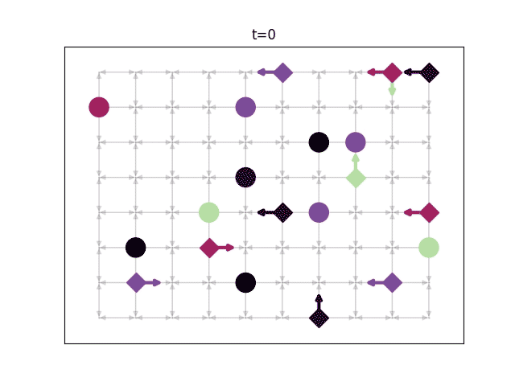

# Distributed Task Allocation - in Python

This repository contains a set of Python functions implementing the distributed, heterogeneous, predictive task allocation algorithm by Solovey et al.

## Requirements
System requirements: ffmpeg (to make videos). `sudo apt install ffmpeg`.
Python requirements: networkx, matplotlib, cplex Python hooks.
`pip install networkx matplotlib -u`.

CPLEX is required.
An academic license for CPLEX can be obtained from [IBM](https://ibm.onthehub.com/WebStore/OfferingDetails.aspx?o=613c3d21-0ce1-e711-80fa-000d3af41938). You should register with an .edu e-mail. Using the academic license is acceptable for non-commercial research: specifically, _"If the results are to be published in conference proceedings or technical journals, the use is acceptable."_ (per the [IBM Academic Initiative guidelines](https://developer.ibm.com/academic/frequently-asked-questions/#faq1)).

The repository contains four files:

## MILP implementation

The functions in `task_allocation_milp.py` implement a centralized MILP solution to the heterogeneous, predictive task allocation problem (Problem 1 in the paper).

## Homogeneous LP implementation

The functions in `task_allocation_homogeneous.py` implement a centralized solution to the (totally unimodular) problem of homogeneous task allocation (Problem 2 in the paper).

## Distributed homogeneous LP implementation

The functions in `task_allocation_distributed.py` implement the dual decomposition distributed solution to the (totally unimodular) problem of homogeneous task allocation (Problem 4 in the paper). At the time of writing, only the optimization subroutine is implemented.

## Utilities

The file `task_allocation_utilities.py` contains functions for plotting agents' trajectories.

## Examples

The file `intruders_chasing.py` creates an example problem with agents chasing intruders on a lattice and calls each of the implemented solvers above.
